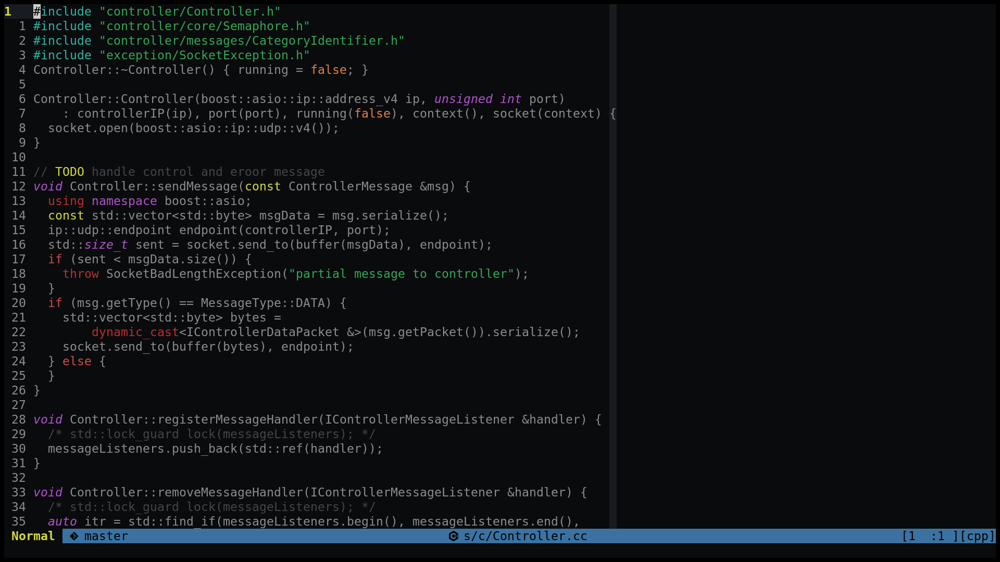
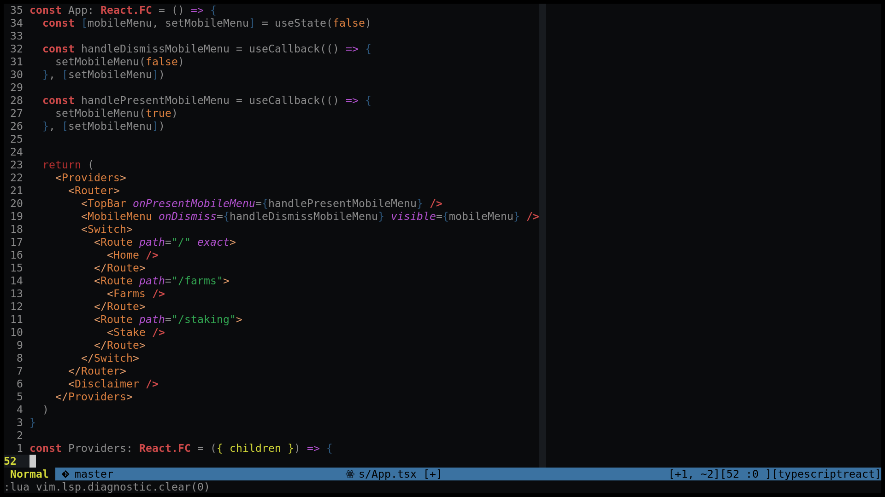
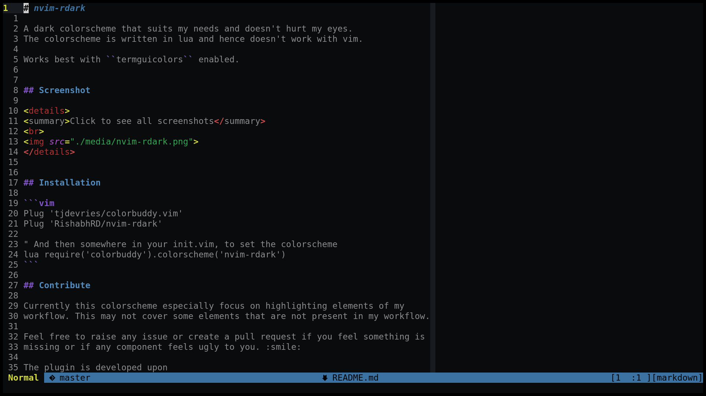

# nvim-rdark

A dark colorscheme that suits my needs and doesn't hurt my eyes.
The colorscheme is written in lua and hence doesn't work with vim.

Works best with ``termguicolors`` enabled.


## Screenshot

<details>
<summary>Click to see all screenshots</summary>
<br>




</details>


## Installation

```vim
Plug 'tjdevries/colorbuddy.vim'
Plug 'RishabhRD/nvim-rdark'

" And then somewhere in your init.vim, to set the colorscheme
lua require('colorbuddy').colorscheme('nvim-rdark')
```

## Contribute

Currently this colorscheme especially focus on highlighting elements of my
workflow. This may not cover some elements that are not present in my workflow.

Feel free to raise any issue or create a pull request if you feel something is
missing or if any component feels ugly to you. :smile:

The plugin is developed upon
[colorbuddy](https://github.com/tjdevries/colorbuddy.nvim).  So, it's very easy to
integrate treesitter highlighting with the plugin.  Currently, it doesn't
include any treesitter highlighting for any language.

But I would include treesitter highlighting for the languages, I feel current
highlighting looks ugly. (Yeah! it would happen only if I would use that
language :smile:). However, if you are using the language and you want to
include the treesitter highlighting then you can raise a PR. It would be
pleasure to merge it.
